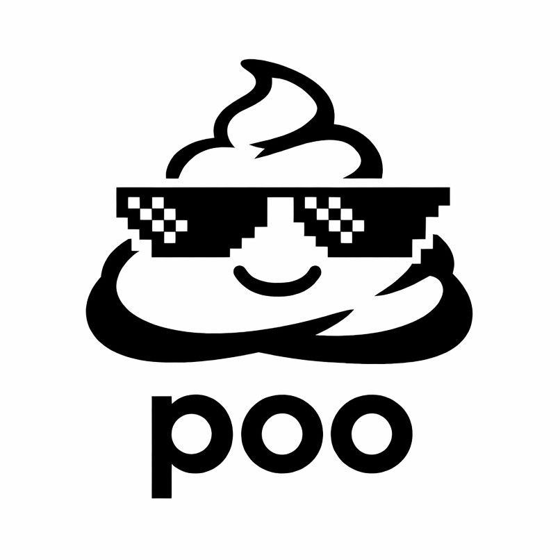

# poo

Coding sucks.



---

## [Data-Types](/docs/types.md)

[`Array`](/docs/types.md#array) 
[`Blob`](#blob) 
[`Bool`](#bool)
[`Char`](#char)
[`Color`](#color)
[`Date`](#date)
[`Enum`](#enum)
[`Generator`](#generator)
[`List`](#list)
[`Map`](#map)
[`Number`](#number)
[`Queue`](#queue) 
[`Pattern`](#pattern)
[`Record`](#record)
[`RegExp`](#regexp)
[`Set`](#set)
[`Stack`](#stack)
[`String`](#string)
[`Store`](#store)
[`Symbol`](#symbol)
[`Tree`](#tree) 
[`Tuple`](#tuple) 
[`Union`](#union)

## Keywords && Operators

[`as`](#as)
[`and`](#and) 
[`break`](#break)
[`catch`](#catch)
[`continue`](#continue)
[`cpy`](#cpy)
[`do`](#do)
[`fail`](#fail)
[`fn`](#fn)
[`if`](#if) 
[`kill`](#kill) 
[`loop`](#loop)
[`new`](#new)
[`obj`](#obj)
[`or`](#or)
[`pkg`](#pkg)
[`ref`](#ref)
[`return`](#return)
[`skip`](#skip)
[`static`](#static)
[`switch`](#switch)
[`use`](#use)
[`val`](#val)
[`yield`](#yield)

[`=`](#)
[`=#`](#)
[`+=`](#)
[`-=`](#)
[`*=`](#)
[`+`](#)
[`-`](#)
[`*`](#)
[`/`](#)
[`%`](#)
[`~=`](#)
[`~==`](#)
[`==`](#)
[`===`](#)
[`!=`](#)
[`!==`](#)
[`>`](#)
[`<`](#)
[`>=`](#)
[`=<`](#) 
[`<=>`](#)
[`||`](#)
[`&&`](#)
[`>>`](#)
[`>>>`](#)
[`!>>`](#)
[`?!>`](#)
[`??>`](#)
[`|?`](#filter-operator)
[`|>`](#map-operator)
[`| `](#reduce-operator)
[`|.`](#pluck-operator)

## Packages

[`audio`](#audio)
[`db`](#db)
[`fs`](#fs)
[`img`](#img)
[`io`](#io)
[`md`](#md)
[`url`](#url)
[`video`](#video)

---

## Let's code!

A lot of people do like **JavaScript** ...

```javascript
// javascript original
const whileLoop = (cond) => decorateCombinator (p => {
  const results = [];
  if (typeof p === 'function' && !cond.many) {
    while (cond(p)) results.push(p.next());
    return results;
  }
  while (true) {
    const result = runWithBacktrack(p, cond);
    if (result === null) break;
    results.push(result);
  }
  return results;
});
```

... but some people do like **poo**. ^-^

```php
fn whileLoop = cond => decorateCombinator (
  p => #[] >>> (p ~= fn && !cond.many)
    ? loop (cond p) do @ += p.next()
    : loop          do @ += runWithBacktrack(p, cond) or break
);
```

---

# Declarations

Declaration Statements are introduced by the keywords: `val` `fn` `obj`

## Value Declaration

```go
val num   = 123; // mutable
val str  #= "moin!"; // immutable (runtime)
val #fix  = "constant!"; // real constant (compiletime)
```

<details>
<summary><b>Declare a Constant</b></summary>

​The `#` prefix on the name (*identifier*) of a value defines a ***compile-time constant***.

```javascript
val #compilerState = "broken"; // compile-time constant
```
</details>

<details>
<summary><b>Seal a Value</b></summary>

​The `#=` operator makes it possible to seal (*freeze*) a value on runtime so it becomes immutable recursively (*deep-freeze*).

```javascript
val exbf #= 'you can't change me!';
```

This operator could also be used to make an value immutable at any later point.

```javascript
val cat = 'miau';
cat += '!!!'; // allowed

cat #= 'wuff'; // assigned and sealed permanently
cat  = 'meow';  // compile-time error: variable is sealed.
```
</details>

## Function Declaration

```scala
// functions with no arguments
fn doSomething = () => print "moin!";
fn doSomething      => print "moin"!;

// with arguments
fn sum = (a, b) => print (a * b);
fn sum =  a, b  => print (a * b); // parens are optional
fn sum =  a  b  => print (a * b); // commas are optional

// classic notation
fn oldieStyle (a, b) { ... }
```

<details>
<summary><b>Call a function</b></summary>

```scala
// no arguments = enforced parens
callSth ();

// exactly 1 argument = optional parens
callSth ("i hate compilers");
callSth "i hate compilers";

// multiple arguments
callSth (100, "moin!"); // positional call
callSth (100 "moin!"); // positional call = optional commas
callSth (b: "moin!", a: 100); // lexical call ("named arguments")
```
</details>

## Object Declaration

The `obj` keyword is used to declare a **new type of object**.

```js
obj Cat = {
  val color  = "black";
  val mood  #= "grumpy"; // grumpy forever >.<

  fn makeNoise = () => print "meow!";
};
```

> [!CAUTION]
> For declaration of *key-value-pairs* see the [Data-Types](#data-types) section.

---

# Control Flow

## `if` | `or`

```c
if <condExpr> {...};

// oneliner
if <condExpr> do <statment>;
```

```c
//
if <condExpr> {...}
or <condExpr> {...}  // like 'else if'
or            {...}; // like `else'

// oneliners
if <condExpr> do <expr> or do <statment>;
if <condExpr> do <expr> or <condExpr> do <statment>;
```

### `switch`

`switch`
`switch!`

```cpp
// implicit comparing against 'true'
switch {
  a  do bark();
  b  do meow();
  c  do woof();
  or do cry();
};

// implicit comparing against 'false'
switch! {
  a  do bark();
  b  do meow();
  c  do woof();
  or do cry();
};
```

### `loop`

```scala
val animals  = ['bird', 'cat', 'dog' ];
val helloPet = (pet) => print "I love my $pet.";

loop (animals as @animal) {
  helloPet @animal;
};

// oneliner
loop animals as animal do helloPet (animal);
loop animals as animal do helloPet animal;
```

## `do`

The `do` keyword is most likely the awkward operator of the language because it's kinda overloaded (not really in the end but...) because it's related to lots of behaviour.

On an statement introduced by `do` more the keywords `and`, `of`, `on` and `or` became also avaible which (except `or`) could only be used in this context.

<details>
<summary><b>as a line guard</b></summary>

...
</details>

<details>
<summary><b>as an expression guard</b></summary>

...
</details>

<details>
<summary><b>as an human-readable code</b></summary>

Let's assume we have sth. like this:

```javascript
obj Hurtable #= {
  val hp = 100;
  val hurt = (n) => hp -= n ?? 1;
};

obj Nerd = {
  use hurtable;
};

val nerd = new Nerd;
```

Now we could obviously do sth. like this:

```scala
nerd.hurt(5); print(nerd.hp); //
nerd.hurt 5; print nerd.hp; // alternative
```

However the `do` keyword enables `on` (to reference a function call on an object) and `of` (to reference a property of an object) in combination with alternative syntax this results in the ability have this semantics:

```java
do hurt (5) on nerd and print hp of nerd;
do hurt 5 on nerd and print hp of nerd;
```
</details>


### the `new` keyword

<details>
<summary><b>Example Code</b></summary>

```scala
obj person = {
  val name = 'Udo';
  val age  = 60;
  
  fn printInfo = () => print "$name is $age years old.";
};

// creates copy/clone/instance of 'person' in its current state
obj inst1 = new person;

person.age = 61;
print(person.age); // 61


obj inst2 = new person;
person.age = 62;

print person.age; // 62
print inst1.age;  // 60
print inst2.age;  // 61
```

```javascript
obj person = (name, age) => {
  val name = 'Udo';
  val age  = 60;
  
  fn printInfo = () => print('@name is @age years old.');
};

obj p1 = new person;
obj p2 = new person (age: 61);
obj p3 = new person (age: 20, name: 'Stella');

p1.printInfo(); //    Udo is 60 years old.
p2.printInfo(); //    Udo is 61 years old.
p3.printInfo(); // Stella is 20 years old.
```
</details>

### the `use` keyword

By the `use` keyword one could apply the value of a ding when defining another one.

<details>
<summary><b>Example Code</b></summary>

```python
obj Person = () => {
  val name;
  val age;
  val country;

  fn whoAmI = () => print "$name is from $country and $age years old.";
};

obj Male = () => {
  use Person;
  val sex = 'male';
}

obj Female = () => {
  use Person;
  val sex = 'female';
}

// change the value of a prop on init
obj Hans = new Male   (name: 'Hans', age: 44);
obj Gabi = new Female (name: 'Gabi', age: 30);

// change the value of a prop when calling
Hans(country: 'Austria').whoAmI();
```
</details>


---

## Philosophy

The language sees itself as an *weird bastard like JavaScript* but with more time to intensionally become like that.

It's compiling to ODIN.

But it could compile to Vanilla JavaScript live in the Browser as well.


